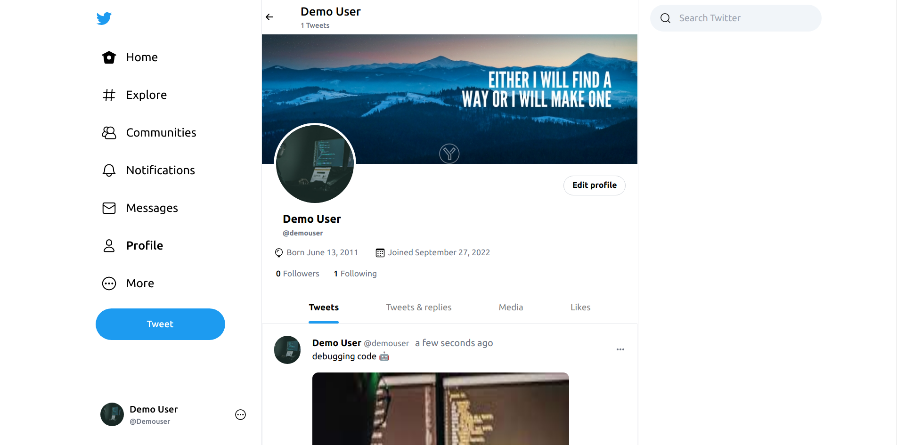
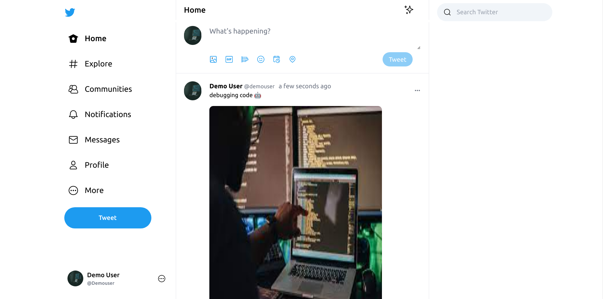

# Full Stack Twitter Clone

## Twitter Deployed [Live Link](#)

## Backend Server Code [Link](#)

## Technologies used in this project

-   Reactjs for frontend
-   Tailwindcss for ui designing
-   Reduxjs-toolkit & redux saga for state managment
-   axios for making http api calls
-   ExpressJS for creating backend server
-   Both Frontend & Backend is written Purely in Typescript with modularized & Optimized Code

# Features List

-   User Signup with email verification
-   User can login using email or username
-   Jwt token in cookie is being used for authentication
-   Post Tweet (Image with captions)
-   Like Tweets
-   update current authenticated user's information
-   View Users profile
-   Follow / UnFollow People
-   View Peoples Follower & Following List (Mutual Followers)

# Pending Features (Yet to Implement)

-   Integrate Socket-io for realtime notifications
-   show notifications on tweet like & on follow
-   Implement comment feature on tweet post
-   Implement Signin with google
-   Implement Forgot Password
-   Option to delete user's own posted tweet
-   Some optimizations & Refactoring of code is needed

#### Screenshot

